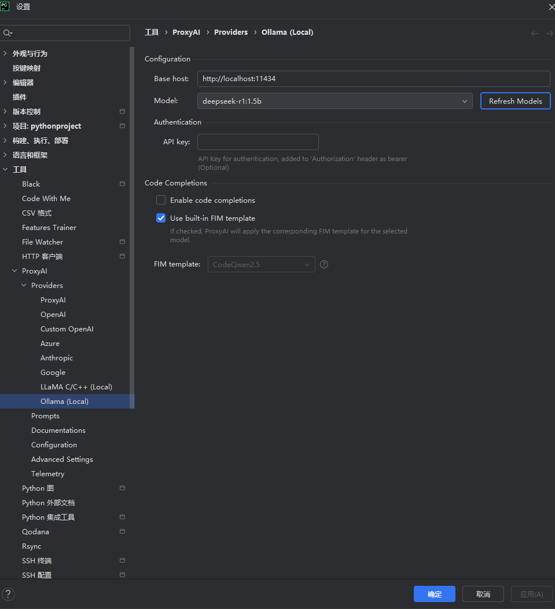

# Assignment 3
**Student Name**: [liziao]  
**Student ID**: [ZY2457B15]  
**Submission Date**: [2025/5/27]

## Obtaining and configuring the online and local models
First, download and install Ollama from the official website. Then click Model in the top-left corner, locate deepseek-r1, select version 1.5b, and copy the command on the right:
```ollama run deepseek-r1:1.5b```


## Compare the performance and features of the online and local models
| Comparison Dimension     | Local Deepseek-r1:1.5b                                    | Deepseekr1 Web Version                                           |
|--------------------------|-----------------------------------------------------------|-------------------------------------------------------------------|
| Model parameters         | 1.5 B                                                     | 1.5 B                                                             |
| Model file size          | ~6 GB (one-time download)                                 | Cloud-hosted, no download required                                |
| Latency                  | GPU: ~70–100 ms; CPU: ~180–250 ms                         | ~200–300 ms                                                       |
| Cost                     | Free local calls (only hardware & power costs)            | Pay-per-call (e.g. \$0.002–\$0.01 per 1K tokens)                  |
| Concurrency              | Depends on local resources, typically 1–2 concurrent jobs | Auto-scaled in cloud, handles high concurrency                    |
| Customization / Fine-tuning | Supports local fine-tuning and plugin development         | API-level parameter control only, no fine-tuning                  |
| Privacy & Security       | Data remains entirely on local machine                    | Data is sent over the network to Deepseek’s servers               |
| Availability             | Works offline (you manage uptime and recovery)            | Requires a stable internet connection; unavailable during outages |
| Maintenance complexity   | You must update models and monitor resources yourself     | Zero maintenance (platform handles updates and upgrades)          |
| Version updates          | Manual: `ollama pull deepseek-r1:1.5b`                     | Always runs the latest cloud model                                |

## The integration process and validate its effectiveness
First, open Settings in PyCharm, search for Proxy AI, and install the plugin.
Then, under Providers, select Ollama and set the model to your locally deployed deepseek-r1:1.5b (as shown). Click Apply to activate it in PyCharm.



You’ll then see Deepseek appear in the right-hand tool window; I asked it to generate a bubble-sort implementation, copied the code into my editor on the left, and it ran successfully.


