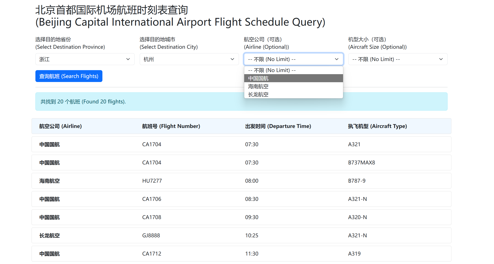

# Assignment 4
**Student Name**: [liziao]  
**Student ID**: [ZY2457B15]  
**Submission Date**: [2025/06/07]

## 1. Background and Functionality

### Project Background
- **High volume of departures.** Beijing Capital International Airport handles thousands of departure flights daily, with numerous airlines, aircraft types, and routes.  
- **Limitations of existing solutions.** Current online look-ups rely on third-party services or stable Internet connections, lacking a lightweight, self-hosted tool for local use when network access is unreliable or data privacy is a concern.  
- **Local, no-dependency solution.** This software leverages a simple Excel timetable and the Flask web framework to provide a local HTTP service. Users need only double-click the executable—no database or complex dependencies—to query flight information in their browser.

### Core Features
1. **Multi-Level Dynamic Filtering**  
   - Four cascading dropdowns: _Province → City → Airline (optional) → Aircraft Size (optional)_.  
   - Selecting a province immediately loads its cities; selecting a city then loads the relevant airlines and aircraft sizes—all without page reloads.
2. **Card-Style Results Display**  
   - Flights sorted by departure time (ascending), each shown as a four-column card: Airline, Flight Number, Departure Time, Aircraft Type.  
   - User-friendly messages for “no results found” or “please select province and city first.”
3. **One-Click Packaging & Deployment**  
   - Uses PyInstaller to bundle the Flask app, Excel data, and HTML templates into a single Windows executable.  
   - On launch, the app can automatically open the default browser to the local service, making deployment trivial.

### Key Technical Challenges
1. **Excel Data Loading & Cross-Environment Paths**  
   - Ensuring correct location of `templates/` and `航班查询软件数据库.xlsx` whether running under Python or as a PyInstaller single-file executable.  
2. **Seamless Front-End Cascading Dropdowns**  
   - Designing lightweight AJAX endpoints (`/get_cities`, `/get_airlines`, `/get_sizes`) and using native `fetch` calls to update dropdown options in real time.  
3. **Single-File Executable Packaging**  
   - Configuring PyInstaller’s `--add-data` flags and using `sys._MEIPASS` in code to extract and load bundled resources at runtime.

---

## 2. Development Environment

- **Hardware Configuration**  
  - CPU: Intel Core i7-10750H  
  - RAM: 16 GB DDR4  
  - Storage: 512 GB NVMe SSD  
- **Operating System**  
  - Windows 10 (64-bit)  
- **Key Software & Versions**  
  - Python 3.10.6  
  - Flask 2.2.2  
  - pandas 1.5.3, openpyxl 3.0.10  
  - Bootstrap 5.3.0  
  - PyInstaller 5.8.0  
- **Development Tools**  
  - VS Code 1.78.2  
  - Git 2.39.1
- **AI models used**  
  - ChatGPT o4-mini-high 
---

## 3. Development Process

1. **Requirements Analysis & Prototype Design**  
   - Defined feature set: cascading filters, optional airline/size selectors, card-style results, and self-contained deployment.  
   - Sketched wireframes to establish UI layout and user flow.
2. **Data Preparation**  
   - Exported Beijing Capital’s departure timetable to Excel; standardized and cleaned columns (“Flight Number,” “Airline,” “Departure Time,” “Province,” “City,” “Aircraft,” “Size,” “Stand”).
3. **Backend Implementation**  
   - Built the main `/` route (GET & POST) in Flask to render filters and handle full queries.  
   - Added lightweight JSON endpoints—`/get_cities`, `/get_airlines`, `/get_sizes`—to return dynamic dropdown data.  
   - Implemented a `load_data()` function that uses `sys._MEIPASS` to locate bundled resources under both Python and PyInstaller environments.
4. **Front-End Development**  
   - Used Jinja2 to render initial dropdown options.  
   - Employed Bootstrap’s grid system for form controls and card layouts.  
   - Attached `onchange` handlers to `<select>` elements, leveraging native `fetch` for AJAX updates and a smooth no-reload experience.
5. **Packaging & Testing**  
   - Bundled into a single executable with:  
     ```bash
     pyinstaller --name flight_query --onefile \
       --add-data "templates;templates" \
       --add-data "航班查询软件数据库.xlsx;." \
       app.py
     ```  
   - Verified on multiple Windows machines: startup, template loading, Excel reading, AJAX cascades, and overall functionality.  
   - Tuned `basedir`, `template_folder`, and data paths to eliminate any `FileNotFoundError`.
6. **Iteration & Optimization**  
   - Refined dropdown-clear logic and user messages based on tester feedback.  
   - Added an auto-browser-launch thread for better UX.  
   - Removed unused dependencies and optimized the executable size.

## 4. Results


## 5. Source Code:
  <a href="./software.zip" download>download code zip</a>

